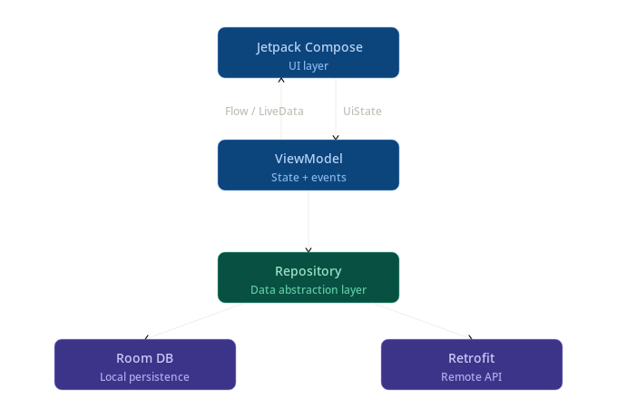
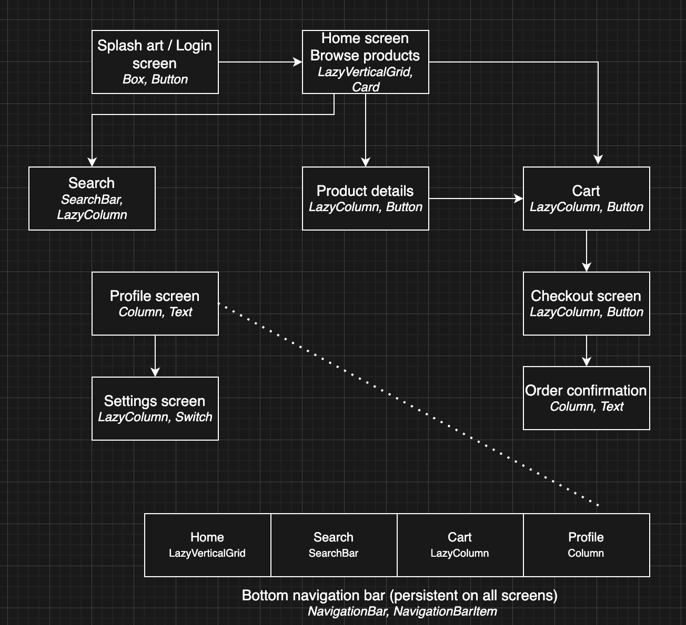

# Outfit Base

## Magazin Online de Haine

**Ionuț Hodoroagă**

University Politehnica of Bucharest

*Tehnici Avansate pentru Dezvoltarea Aplicațiilor Mobile*

April 24, 2026

---

## Cuprins

1. Descrierea Proiectului
2. Funcționalități Principale
3. Arhitectură & Navigare UI
4. Referințe

---

## 1. Outfit Base – Descrierea Proiectului

### Ce este Outfit Base?

**Outfit Base** este o aplicație Android pentru navigarea și cumpărarea de haine dintr-un catalog online.

### Contextul aplicației

- Utilizatorul răsfoiește produse grupate pe categorii
- Poate căuta după cuvinte cheie
- Adaugă produse în coș și plasează comenzi
- Își poate gestiona profilul și preferințele

---

## 2. Funcționalități Principale

### 🛍️ Catalog & Căutare

- Listare produse printr-un API REST
- Filtrare pe categorii (tricouri, pantaloni, rochii etc.)
- Căutare după numele unui produs
- Ecran cu detaliile produsului cu imagini, descriere, preț

### 👤 Profil & Setări

- Ecran de profil cu date utilizator și istoric comenzi
- Ecran de setări: temă (light/dark/system), limbă (română/engleză)

### 🛒 Coș & Comenzi

- Adăugare / eliminare produse din coș
- Persistență locală produse din coș la închiderea aplicației
- Ecran de checkout

---

## 3. Arhitectură & Navigare UI

### Arhitectura Aplicației

Fluxul de date prin straturile aplicației:

- **Jetpack Compose** (UI layer) ↔ **ViewModel** (State + events) prin `StateFlow` și `UiState`
- **ViewModel** → **Repository** (Data abstraction layer)
- **Repository** → **Room DB** (Local persistence) și **Retrofit** (Remote API)

### Fluxul de navigare și ecranele principale

Ecranele principale și componentele Compose folosite:

- **Home screen / Browse products** — `LazyVerticalGrid, Card, DropdownMenu`
- **Search** — `OutlinedTextField, LazyColumn, Card, DropdownMenu`
- **Product details** — `LazyColumn, Button, AsyncImage`
- **Cart** — `LazyColumn, Card, OutlinedButton`
- **Checkout screen** — `LazyColumn, OutlinedTextField, Button`
- **Order confirmation** — `Column, Button, Text`
- **Profile screen** — `LazyColumn, Card, Button`
- **Settings screen** — `Column, RadioButton, TextButton`
- **Bottom navigation bar** (persistent on all screens) — `NavigationBar, NavigationBarItem`
  - Home (`LazyVerticalGrid`), Search (`OutlinedTextField`), Cart (`LazyColumn`), Profile (`LazyColumn`)

---

## 4. Referințe

1. Android Developers, *Guide to App Architecture*, <https://developer.android.com/topic/architecture>
2. Android Developers, *Jetpack Compose*, <https://developer.android.com/jetpack/compose>
3. Android Developers, *Navigation with Compose*, <https://developer.android.com/jetpack/compose/navigation>
4. Square Open Source, *Retrofit – A type-safe HTTP client for Android and Java*, <https://square.github.io/retrofit/>
5. Android Developers, *Room Persistence Library*, <https://developer.android.com/training/data-storage/room>
6. diagrams.net, *draw.io – Free online diagram software*, <https://app.diagrams.net/>
